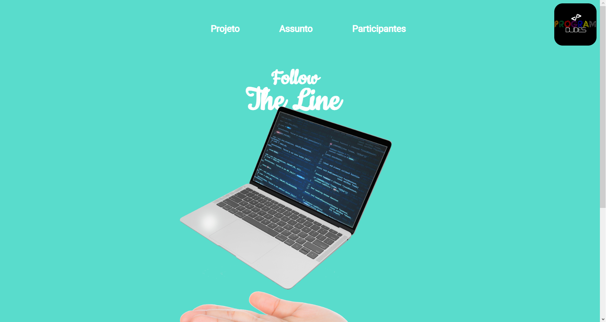

# SiteSeguidor

Este projeto é um site desenvolvido para fornecer aulas e recursos educacionais sobre robótica, programação e eletrônica básicas.

## Protótipo

Confira o protótipo do site no Figma: [Protótipo](inserir-link-do-figma-aqui)

## Aulas e Conteúdos

As aulas e conteúdos estão organizados em um documento no Notion: [Aulas](inserir-link-do-notion-aqui)

## Demonstração

Você pode visualizar o site ao vivo no GitHub Pages: <a href="https://programdudes.github.io/SiteSeguidor/" target="_blank">Site</a>
|  |   |   |
| ----- | ----- | ----- |
| 
Home
 | foto2 | foto3 |

## Licença

Este projeto está licenciado sob a licença [Creative Commons Attribution-NonCommercial-ShareAlike 4.0 International (CC BY-NC-SA 4.0)](https://creativecommons.org/licenses/by-nc-sa/4.0/).

Isso significa que você é livre para:

- Compartilhar: copiar e redistribuir o material em qualquer suporte ou formato.
- Adaptar: remixar, transformar e criar a partir do material.

De acordo com os termos da licença, você deve:

- Atribuir o devido crédito ao autor original.
- Utilizar o material apenas para fins não comerciais.
- Compartilhar o trabalho derivado sob a mesma licença.

Para mais informações sobre os termos e condições da licença, consulte o arquivo [LICENSE](https://creativecommons.org/licenses/by-nc-sa/4.0/legalcode).

## Contatos

## A Equipe
A Program Dudes é uma equipe de desenvolvimento formada por universitários de Engenharia de Software

